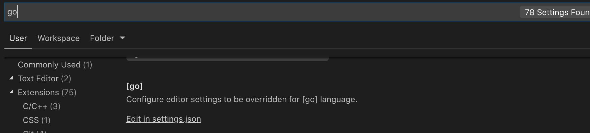
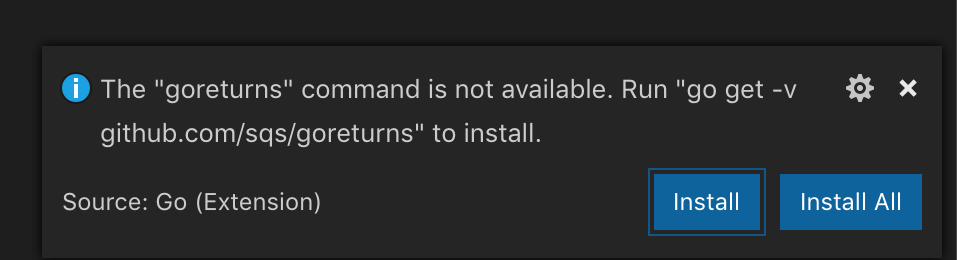

# chapter02 환경설정

[설치 및 실행환경 설정](https://github.com/ChanGrea/golang_study)을 참고하면 Go를 쓸 수는 있다.

## :banana: VScode 환경셋팅

### :strawberry: Extension 설치

VSCode의 Extension 메뉴에서 검색하여 설치한다.


위 Extension을 설치하고 나면 작업하고자 하는 폴더를 만들고, `bin`, `pkg`, `src` 폴더를 만들어준다.

각 폴더의 역할을 아래와 같다.

- bin : 바이너리 파일들이 들어간다고 bin이라는 이름이 붙었다. 여기에는 실행 파일들이 들어간다.
- pkg : 패키지 오브젝트 파일들이 들어간다. 소스가 컴파일된 후의 코드들이 여기 들어가는 것이지만, 실행 가능한 파일들은 아니다. 라이브러리들이 들어간다고 생각하면 된다.
- src : 소스 코드들이 들어간다. 이 아래에 자신만의 패키지 경로를 작성하면 된다.

### :strawberry: GOROOT & GOPATH 확인

아래 명령어를 통해 GOROOT와 GOPATH 확인

```sh
go env
```

- GOROOT : go가 설치된 위치
- GOPATH : go 명령어가 실행될 위치이며, 이 곳에 패키지와 라이브러리가 설치되고, go로 작성된 파일들이 위치하게 된다.

### :strawberry: VSCode 내 go setting

VScode에서 go 프로그래밍을 좀 더 편하게 하기 위한 설정이다.

VSCode에서 "Command" + "," (Mac 기준) or "ctrl" + ","(Linux or Window 기준.. 아마도(?))를 누르면 Settigns 메뉴가 뜬다.



'go'를 검색해서 \[go\] 부분의 "Edit in settings.json"를 클릭한다.

settings 파일에 아래와 같이 추가해준다.

```json
// Go Language Configuration
"go.buildOnSave": true,
"go.lintOnSave": true,
"go.vetOnSave": true,
"go.buildTags": "",
"go.buildFlags": [],
"go.lintFlags": [],
"go.vetFlags": [],
"go.coverOnSave": false,
"go.useCodeSnippetsOnFunctionSuggest": false,
"go.formatOnSave": true,
// goreturns 은 goimports(자동 임포트), gofmt(자동 포맷팅)를 사용하고 리턴코드도 자동으로 채워준다.
"go.formatTool": "goreturns",
"go.gocodeAutoBuild": false,
// 위에서 확인했던 GOROOT를 여기에 적는다.
"go.goroot": "/usr/local/go",
// 여기에는 위에서 생성한 작업 디렉터리를 적는다. 나의 경우는 go-sutdy라는 폴더를 workspace에 생성했다.
"go.gopath": "/Users/chanyoung/workspace/go-study"
```

### :strawberry: 추가 extension 설치

모든 셋팅이 완료됬고, src 폴더에 '.go' 확장자를 붙인 파일을 생성하여 코드를 작성해보자.

그러면 아래와 같이 오른쪽 하단에 extension을 설치하라고 팝업이 뜬다.

install보단 **install all**을 선택하자. (이후에 다 필요한 것들이 설치된다.)



### :strawberry: debugging & build & execute

#### go 디버깅

`run` 명령어를 통해 디버깅을 한다.

빌드를 하지 않고 빠르게 실행만 해보는 용도이다.

```sh
go run <go file명>
```

#### go 빌드

`build` 명령어를 사용한다.

빌드하게 되면 **exe** 파일이 생성된다.

```sh
go build <go file명>
```

#### 빌드된 파일 실행

**exe** 파일을 실행하는 것은 간단하다.

```sh
./<파일명>
```

## :banana: GoLand 사용

사실 위의 모든 셋팅들이 귀찮다면, [GoLand](https://www.jetbrains.com/ko-kr/go/?gclid=EAIaIQobChMI78Dt7azl5wIVWq6WCh2ghgbwEAAYASAAEgKP0vD_BwE)를 쓰면 된다.(대신 **유료**)
